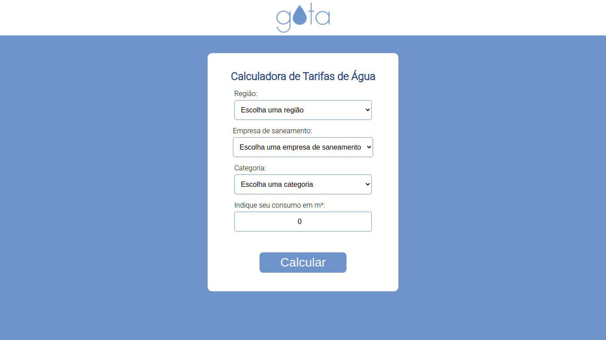
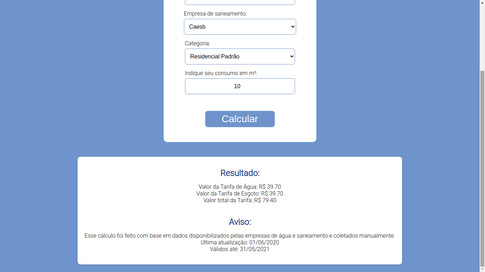

# GOTA

Acesse o GOTA em: http://gota-eta.vercel.app/

Deploy feito na Vercel.

<br/>

## O que é o GOTA?

GOTA é um acrônimo para "Gerenciador Online de Tarifas de Água", idealizado por @gabriel-paiva e criado inicialmente como projeto da matéria de Requisitos de Software da Universidade de Brasília pelos alunos @gabriel-paiva, @eliseukadesh67, @WashingtonBispo e @RodrigoTCLima.

A versão atual do GOTA foi resumida a função de Calculadora de tarifas de água e esgoto de vários estados brasileiros e está em constante evolução.

## Imagens



<br/>
<br/>



<br/>
<br/>

## Rodando o projeto localmente

1. Clone o projeto com o comando:

``` 
git clone https://github.com/gabriel-paiva/gota
```

2. Entre na pasta do projeto
``` 
cd gota
```

3. Instale as dependências
``` 
npm install
```

4. Suba o servidor de desenvolvimento
``` 
npm run dev
# ou
yarn dev
```

5. Acesse o projeto pelo navegador na URL: 
```
localhost:3000
```